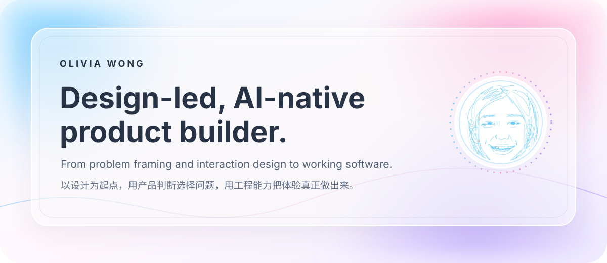
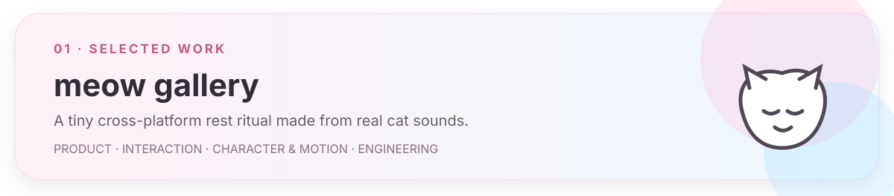
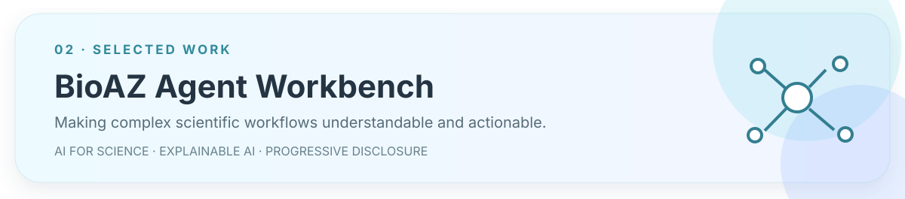
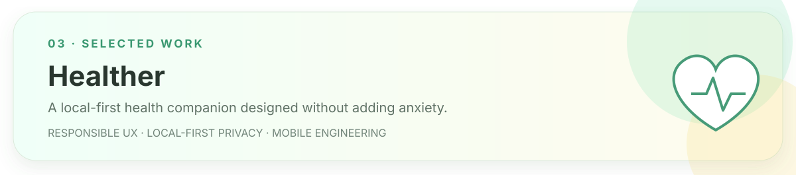

  

  

  <a href="mailto:wongolivia336@gmail.com"><b>Email</b></a>
  &nbsp;&nbsp;·&nbsp;&nbsp; LinkedIn coming soon
  &nbsp;&nbsp;·&nbsp;&nbsp; Portfolio coming soon

 

> ### I like building where things are still a little unclear.
>
> My work moves between **AI for Science**, explainable interfaces, health tools, and curiosity-led experiments. The subjects change; the question underneath stays the same: **how can complex technology feel clear, useful, and human?**
>
> 我关注 AI for Science、可解释界面、健康工具，也会做一些由好奇心驱动的实验。题目可以变化，但底层的问题始终一致：如何让复杂技术变得清晰、可用，也更有人味？

 

## Selected work · 代表作品

Not an audio manager and not another productivity timer: a desktop pet that turns recordings into bubbles you can pop when it is time to pause.

把真实猫叫变成声音泡泡的跨端休息仪式。覆盖角色、交互、动效、Web、Windows 桌宠、Android 与私有云同步。

[Live web](https://domi-meow-gallery.vercel.app/) · [View repository →](https://github.com/wongolivia336-a11y/cat-meow-gallery)

 

A product prototype coordinating AI teammates across project context, task planning, human checkpoints, scientific deliverables, and retained knowledge.

真实实习中的 AI for Science 产品探索：用渐进式披露、可解释协作和关键确认点，把复杂科研工作流变成可理解、可推进的产品体验。

[Live prototype](https://prototype-bioaz-agent-workbench.vercel.app/) · [View repository →](https://github.com/wongolivia336-a11y/bioaz-agent-workbench)

 

Medication reminders, health records, follow-up preparation, and carefully bounded health information — designed around privacy and responsible UX.

一个本地优先的长期健康管理助手。它不替用户诊断，而是克制地做好提醒、记录、整理和理解。

[View repository →](https://github.com/wongolivia336-a11y/healther)

 

## Curiosity-led experiments · 好奇心实验

<table>
  <tr>
    <td width="50%" valign="top">
      <h3>✦ Now · 现在</h3>
      
<b>DMPK & tumor-report agents</b> Interaction studies inside the wider BioAZ workbench.

      
<b>BioAZ invitation system</b> Visual communication for scientific collaboration.

    </td>
    <td width="50%" valign="top">
      <h3>◌ Next · 接下来</h3>
      
<b>Zhang Zao Poetry Gallery</b> Poetry, space, rhythm, and digital reading.

      
<b>Psychologist Café</b> Conversational philosopher and psychologist personas.

    </td>
  </tr>
</table>

 

## How I work · 我的工作方式

| 01 · Frame | 02 · Design |
| --- | --- |
| Find the real problem beneath the feature request. 找到功能请求背后的真实问题。 | Make complexity visible without making it overwhelming. 让复杂性可见，但不让它压倒用户。 |
| **03 · Build** | **04 · Learn** |
| Prototype deeply enough that the product can be felt, not just explained. 把原型做深，让产品可以被体验，而不只被描述。 | Put it in front of reality, then revise the judgment — not only the pixels. 让作品接触真实世界，再修正判断，而不只是像素。 |

 

  <b><i>AI expands what one person can own.</i></b> 
  <i>Taste and judgment still decide what is worth building.</i>
    
  AI 扩大一个人能够负责的边界，而审美与判断仍决定什么值得被做出来。

<!-- Replace the two coming-soon labels when LinkedIn and portfolio URLs are ready. -->
