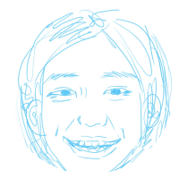

<table>
  <tr>
    <td width="68%" valign="middle">
      OLIVIA WONG · 王奥莉
      <h1>Design-led, AI-native product builder.</h1>
      

        I turn complex ideas into thoughtful, working products — 
        from problem framing and interaction design to shipped software.
      

      
以设计为起点，用产品判断选择问题，用工程能力把体验真正做出来。

      

        <a href="mailto:wongolivia336@gmail.com">Email</a>
        &nbsp;·&nbsp; LinkedIn coming soon
        &nbsp;·&nbsp; Portfolio coming soon
      

    </td>
    <td width="32%" align="center" valign="middle">
      
    </td>
  </tr>
</table>

### I like building where things are still a little unclear.

My work moves between **AI for Science**, explainable interfaces, health tools, and curiosity-led experiments. The subjects change; the question underneath stays the same: **how can complex technology feel clear, useful, and human?**

我关注 AI for Science、可解释界面、健康工具，也会做一些由好奇心驱动的实验。题目可以变化，但底层的问题始终一致：如何让复杂技术变得清晰、可用，也更有人味？

---

## Selected work · 代表作品

### 01 — [meow gallery](https://github.com/wongolivia336-a11y/cat-meow-gallery) ↗

**A tiny cross-platform rest ritual made from real cat sounds.** 
Not an audio manager and not another productivity timer: a desktop pet that turns recordings into bubbles you can pop when it is time to pause.

把真实猫叫变成声音泡泡的跨端休息仪式。覆盖角色、交互、动效、Web、Windows 桌宠、Android 与私有云同步。

`Product direction` · `Interaction design` · `Character & motion` · `Cross-platform engineering`

[Live web](https://domi-meow-gallery.vercel.app/) · [Repository](https://github.com/wongolivia336-a11y/cat-meow-gallery)

---

### 02 — [BioAZ Agent Workbench](https://github.com/wongolivia336-a11y/bioaz-agent-workbench) ↗

**Making complex scientific workflows understandable and actionable.** 
A product prototype for coordinating AI teammates across project context, task planning, human checkpoints, scientific deliverables, and retained knowledge.

真实实习中的 AI for Science 产品探索：用渐进式披露、可解释协作和关键确认点，把复杂科研工作流变成可理解、可推进的产品体验。

`AI for Science` · `Explainable AI` · `Progressive disclosure` · `Product prototyping`

[Live prototype](https://prototype-bioaz-agent-workbench.vercel.app/) · [Repository](https://github.com/wongolivia336-a11y/bioaz-agent-workbench)

---

### 03 — [Healther](https://github.com/wongolivia336-a11y/healther) ↗

**A local-first health companion designed without adding anxiety.** 
Medication reminders, health records, follow-up preparation, and carefully bounded health information — designed around privacy and responsible UX.

一个本地优先的长期健康管理助手。它不替用户诊断，而是克制地做好提醒、记录、整理和理解。

`Product strategy` · `Responsible UX` · `Local-first privacy` · `Mobile engineering`

[Repository](https://github.com/wongolivia336-a11y/healther)

---

## Curiosity-led experiments · 好奇心实验

Some projects begin with a brief. Others begin with a poem, a character, or a question I cannot stop thinking about.

有些项目从需求开始，也有些从一首诗、一个角色，或一个挥之不去的问题开始。

| Now / 现在 | Next / 接下来 |
| --- | --- |
| **DMPK & tumor-report agents** — interaction studies inside the wider BioAZ workbench | **Zhang Zao Poetry Gallery** — exploring poetry, space, rhythm, and digital reading |
| **BioAZ invitation system** — visual communication for scientific collaboration | **Psychologist Café** — conversational philosopher and psychologist personas |

---

## How I work · 我的工作方式

| Frame | Design | Build | Learn |
| --- | --- | --- | --- |
| Find the real problem beneath the feature request. | Make complexity visible without making it overwhelming. | Prototype deeply enough that the product can be felt, not just explained. | Put it in front of reality, then revise the judgment — not only the pixels. |
| 找到功能请求背后的真实问题。 | 让复杂性可见，但不让它压倒用户。 | 把原型做深，让产品可以被体验，而不只被描述。 | 让作品接触真实世界，再修正判断，而不只是像素。 |

 

  <i>AI expands what one person can own. Taste and judgment still decide what is worth building.</i>
    
  AI 扩大一个人能够负责的边界，而审美与判断仍决定什么值得被做出来。

<!--
When ready, replace the two "coming soon" labels in the hero with:
- LinkedIn: https://www.linkedin.com/in/YOUR-HANDLE/
- Portfolio: your final public portfolio URL
-->
